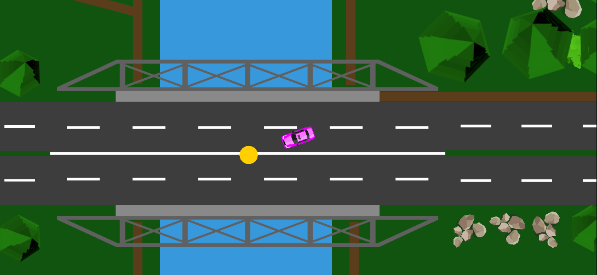
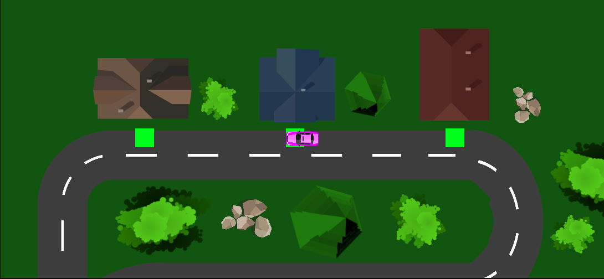

A 2D top-down delivery game made in Unity with C#. The player drives around a small town, picks up packages and delivers them against the clock.

## Highlights

- **Time-based deliveries** as the core loop.
- **Vehicle handling with Unity's 2D physics** (`Rigidbody2D`, `Collider2D`) for movement and collisions.
- **Tilemap-based levels,** which makes it quick to build and extend the town layout.

