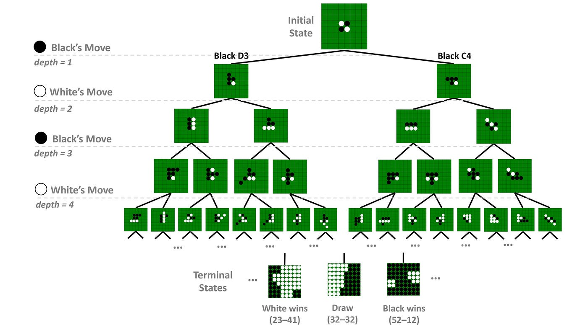
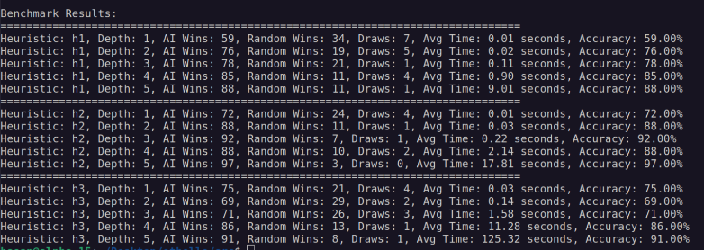

A Python implementation of the classic board game Othello (Reversi) with an AI opponent built on the minimax algorithm. The interesting part is comparing how different evaluation strategies play against each other and how search depth trades off against speed.

Built as a team project with Hasan Pekedis and Hasan Özeren.

## Features

- **Three game modes:** human vs. human, human vs. AI, and AI vs. AI.
- **Configurable AI:** choose the search depth and one of three heuristics:
  - **h1 – Disc difference:** maximize the difference in disc count.
  - **h2 – Positional advantage:** score the board with position weights, favoring corners and edges.
  - **h3 – Mobility:** maximize your own legal moves while limiting the opponent's.
- **Command-line interface** for entering moves and configuring games.

## Benchmarking

A separate module plays each AI configuration against a random player and records the results and average move times. This shows the computational cost of deeper searches and how effective each heuristic is.

## Structure

- **Othello module:** board state, move validation and game-over detection.
- **AI player module:** minimax search and the three heuristic evaluators.
- **Benchmark module:** automated matches and performance metrics.
