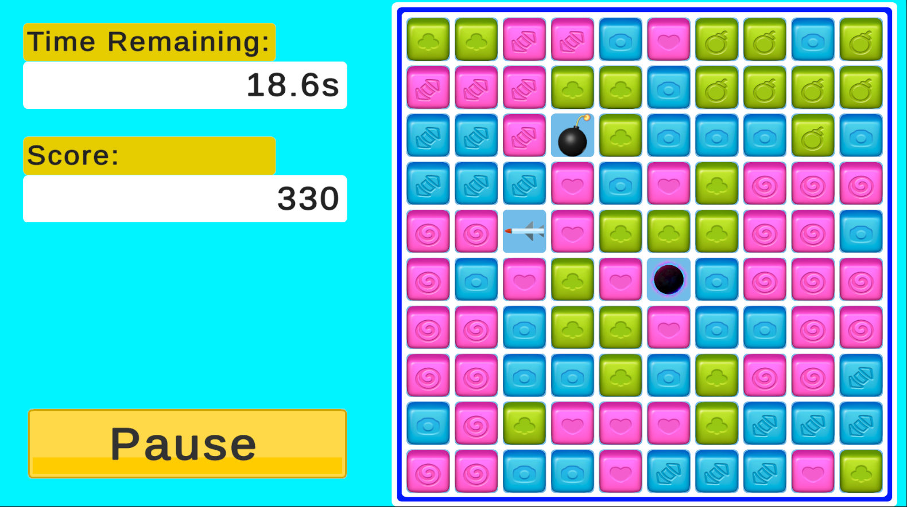
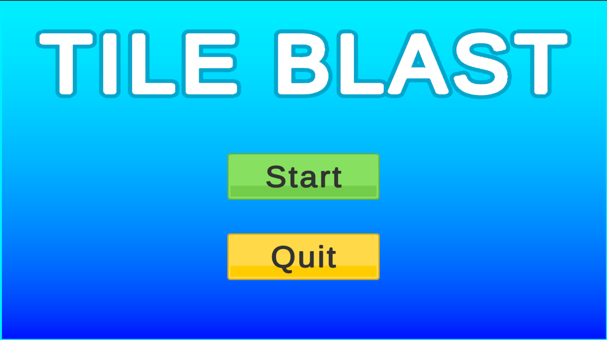
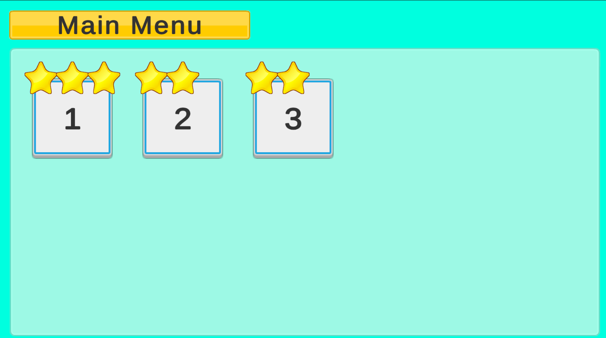
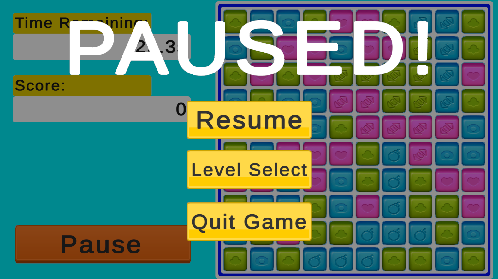
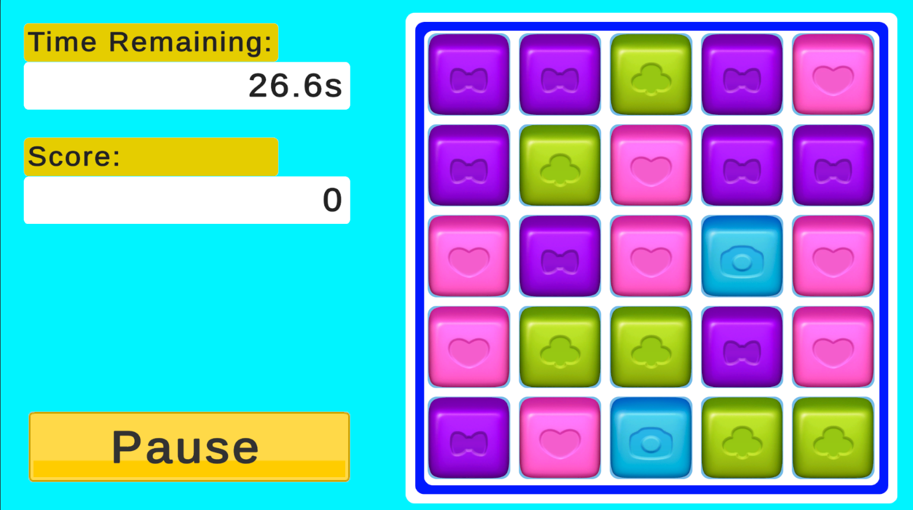

A match-style puzzle game built in Unity. Players tap clusters of same-colored blocks to clear them, while bigger clusters spawn special blocks that clear large parts of the board. Most of the work went into making the game feel responsive: menu flow, feedback on every interaction, and a board that never gets stuck.

## Gameplay

- **Grid-based board.** Generates a board of colored blocks; tapping a connected cluster destroys it and awards points.
- **Gravity and refill.** Blocks above a cleared area fall into the gaps and new blocks spawn from the top.
- **Special blocks.** Large clusters turn into special blocks based on predefined rules:
  - **Bomb:** clears a 3×3 area.
  - **Missile:** clears an entire row or column.
  - **Black hole:** clears the whole board.
- **Deadlock prevention.** When no valid move remains, the board is automatically reshuffled.

## Menus and progression

**Main menu.** Animated *Start* and *Quit* buttons with sound effects on hover and click.

**Level selection.** A grid of levels showing the 0–3 stars earned on each, built with Unity's Grid Layout Group so it adapts to different screen sizes.

**Pause menu.** Opened with `Esc` or an on-screen button; pauses the game with `Time.timeScale = 0` and offers *Resume*, *Level Select* and *Quit* over a semi-transparent overlay. The selected button scales up so it is always clear which option is active.

## How it's built

- **C# with an object-oriented structure,** keeping board logic, block types and UI in separate modules.
- **Coroutines** to sequence destruction, falling and refill animations.
- **Event-driven UI** so menus and buttons react to game state without polling.

## Next steps

Combo mechanics and more power-ups, more levels with increasing difficulty, and object pooling to cut allocations during large chain reactions.
